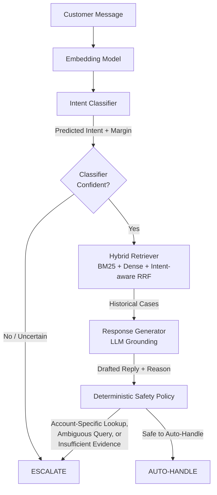

# AmazonHelp AI Support Agent

An autonomous customer support agent built on the Twitter Customer Support (TWCS) dataset, designed to safely triage and resolve support queries using a deterministic safety policy, semantic intent classification, and intent-aware hybrid retrieval.

## System Architecture

The agent strictly separates probabilistic operations (classification, retrieval, generation) from deterministic operations (escalation gating and safety policies).



### 1. Intent Discovery & Classification
- **Discovery**: An LLM-assisted intent discovery pipeline: normalize noisy customer messages into their underlying operational problem, cluster those normalized representations to generate candidate intents, then use an LLM to name and consolidate candidates before freezing the taxonomy (yielding 104 operational intents).
- **Training**: Training examples are assigned to the frozen taxonomy to create robust, averaged semantic intent prototypes.
- **Runtime**: New messages are classified via cosine similarity to the prototypes, generating both a predicted `intent_id` and an uncertainty margin.

### 2. Intent-Aware Hybrid Retrieval
When the classifier is confident, the query and predicted intent are passed to the `HybridRetriever`.
- **BM25**: Lexical search against the historical support case corpus.
- **Dense**: Semantic search using Titan embeddings.
- **RRF (Reciprocal Rank Fusion)**: Combines BM25 and Dense scores, heavily boosting cases that also match the predicted intent. 

### 3. LLM Response Generation
The top retrieved historical cases are injected into the context window. The LLM is explicitly instructed that historical customer messages are untrusted data, and it is strictly forbidden from inventing policies, SLAs, or actions not supported by the retrieved AmazonHelp responses.

### 4. Deterministic Safety Policy
The `apply_safety_policy` gate is the final authority. It will override the LLM and escalate to a human if:
1. The initial classifier was uncertain.
2. The query contains multiple/ambiguous issues.
3. The query matches specific safety regexes indicating the need for private account lookups, payment modification, or authenticated access (e.g., "check my order", "update my card").
4. The retrieved evidence is too weak (below the density score threshold).
5. The LLM's own internal logic recommends escalation.

## Evaluation Strategy

The evaluation pipeline guarantees zero data leakage between training, discovery, retrieval, and testing by partitioning conversations using `conversation_id`.

Metrics are computed against a golden set of 200 manually-labeled cases comparing:
1. **Trivial Baselines**: Majority-class intent & Always-escalate policy.
2. **Simple Baseline**: Directly returning the response from the BM25 top-1 search result.
3. **Proposed System**: Full Hybrid + LLM + Safety architecture.

Quality of the generated auto-handled responses is evaluated using an LLM-as-a-judge across correctness, groundedness, completeness, and communication quality, comparing the System directly against the BM25 baseline. Human-judge agreement is validated using Spearman's rank correlation coefficient, Quadratic Cohen's Kappa, and Mean Absolute Error (MAE).

## Reproduction

The submitted results use frozen model-building artifacts (`data/processed/intent_taxonomy.json`, `data/processed/intent_assignments.parquet`, `data/processed/intent_assignment_embeddings.npy`, etc.) because intent discovery is an LLM-assisted, multi-stage offline process that is computationally expensive.

> [!NOTE]
> **Provenance and Reproducibility Disclaimer:**  
> Because taxonomy discovery uses external LLM inference, exact regeneration of the taxonomy is not guaranteed across provider/model revisions. For the reported submission results, the generated taxonomy and associated model-building artifacts are frozen and included with the repository. The data split, random seed, model identifiers, thresholds, taxonomy hash, and evaluation commands are recorded for provenance in `artifacts/final_run_manifest.json`.

### Quick Reproduction Path (< 15 Minutes)
This reproduces the reported evaluation results using the exact frozen artifacts from the submission run:

```bash
bash run_quick_reproduction.sh
```

**What this executes:**
1. **Artifact Verification (`scripts/verify_submission_artifacts.py`)**: Validates the 104-intent taxonomy, sha256 hash match, 8,000 training case coverage, 200 golden evaluation cases, and 0% train/eval leakage.
2. **Hybrid Retriever Build (`scripts/06_build_retriever.py`)**: Reconstructs BM25 index and normalizes dense vectors from frozen training embeddings (~2-3 sec).
3. **Classifier Construction (`scripts/07_build_classifier.py`)**: Calculates 104 prototype centroid vectors from frozen embeddings (~1-2 sec).
4. **Component Smoke Test (`scripts/08_test_agent_components.py`)**: Verifies classification, margin estimation, and hybrid retrieval (~2 sec).
5. **System Evaluation (`scripts/11_run_evaluation.py`)**: Evaluates the agent against the 200-case human golden set across 2 baselines and the proposed system (~20-30 sec).
6. **LLM Judge Evaluation (`scripts/12_llm_judge.py`)**: Uses Bedrock LLM-as-a-judge to evaluate matched auto-handled cases on correctness, groundedness, completeness, and quality (~2-3 min).
7. **Judge Agreement Analysis (`scripts/13_judge_human_agreement.py`)**: Evaluates Spearman rank correlation, Quadratic Cohen's Kappa, and MAE between human and LLM judges.

**Observed Total Runtime**: ~3 to 5 minutes.

---

### Full Rebuild Path (Audit / Transparency Only)
To regenerate the taxonomy, embeddings, and training assignments from scratch via AWS Bedrock API calls:

```bash
bash run_full_rebuild.sh
```

**Sequence:**
1. `python scripts/10_create_eval_set.py`: Creates the 200-case golden split and 8,000-case training split (`seed=42`).
2. `python scripts/04_discover_intents.py`: Executes the 6-stage LLM-assisted discovery pipeline (core problem extraction, Titan v2 embedding, agglomerative clustering, min-size filter, LLM naming & semantic deduplication to 104 intents, and training set assignment).
3. `python scripts/05_diagnose_similarity.py`: Computes cosine similarity distribution diagnostics.
4. `python scripts/06_build_retriever.py`: Builds retrieval corpus and BM25 index.
5. `python scripts/07_build_classifier.py`: Computes intent prototype centroids.
6. `python scripts/08_test_agent_components.py`: Tests agent components.

*Note: The Full Rebuild path deliberately stops before evaluation because human labeling is required on the golden set (`scripts/10b_prepare_human_labels.py`) before running the evaluation scripts.*  
*Observed Runtime: ~60 to 90 minutes (due to controlled, rate-limited Bedrock API calls).*

