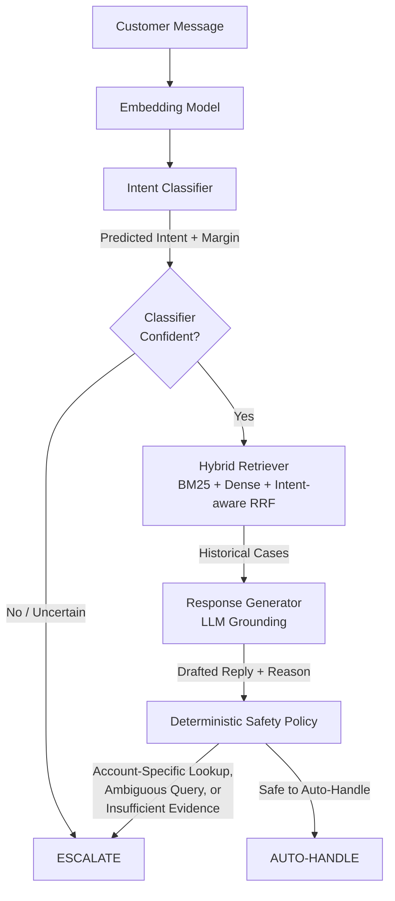

# AmazonHelp AI Support Agent

An autonomous customer support agent built on the Twitter Customer Support (TWCS) dataset, designed to safely triage and resolve support queries using a deterministic safety policy, semantic intent classification, and intent-aware hybrid retrieval.

## System Architecture

The agent strictly separates probabilistic operations (classification, retrieval, generation) from deterministic operations (escalation gating and safety policies).

### 1. Intent Discovery & Classification
- **Discovery**: A deterministic training sample is embedded and semantically grouped using Agglomerative Clustering. An LLM names these clusters to form a frozen taxonomy. 
- **Training**: Training examples are assigned to the frozen taxonomy to create robust, averaged semantic intent prototypes.
- **Runtime**: New messages are classified via cosine similarity to the prototypes, generating both a predicted `intent_id` and an uncertainty margin.

### 2. Intent-Aware Hybrid Retrieval
When the classifier is confident, the query and predicted intent are passed to the `HybridRetriever`.
- **BM25**: Lexical search against the historical support case corpus.
- **Dense**: Semantic search using Titan embeddings.
- **RRF (Reciprocal Rank Fusion)**: Combines BM25 and Dense scores, heavily boosting cases that also match the predicted intent. 

### 3. LLM Response Generation
The top retrieved historical cases are injected into the context window. The LLM is explicitly instructed that historical customer messages are untrusted data, and it is strictly forbidden from inventing policies, SLAs, or actions not supported by the retrieved AmazonHelp responses.

### 4. Deterministic Safety Policy
The `apply_safety_policy` gate is the final authority. It will override the LLM and escalate to a human if:
1. The initial classifier was uncertain.
2. The query contains multiple/ambiguous issues.
3. The query matches specific safety regexes indicating the need for private account lookups, payment modification, or authenticated access (e.g., "check my order", "update my card").
4. The retrieved evidence is too weak (below the density score threshold).
5. The LLM's own internal logic recommends escalation.

## Evaluation Strategy

The evaluation pipeline guarantees zero data leakage between training, discovery, retrieval, and testing by partitioning conversations using `conversation_id`.

Metrics are computed against a golden set of 200 manually-labeled cases comparing:
1. **Trivial Baselines**: Majority-class intent & Always-escalate policy.
2. **Simple Baseline**: Directly returning the response from the BM25 top-1 search result.
3. **Proposed System**: Full Hybrid + LLM + Safety architecture.

Quality of the generated auto-handled responses is evaluated using an LLM-as-a-judge across correctness, groundedness, completeness, and communication quality, comparing the System directly against the BM25 baseline. Human-judge agreement is validated using Spearman's rank correlation coefficient, Quadratic Cohen's Kappa, and Mean Absolute Error (MAE).
