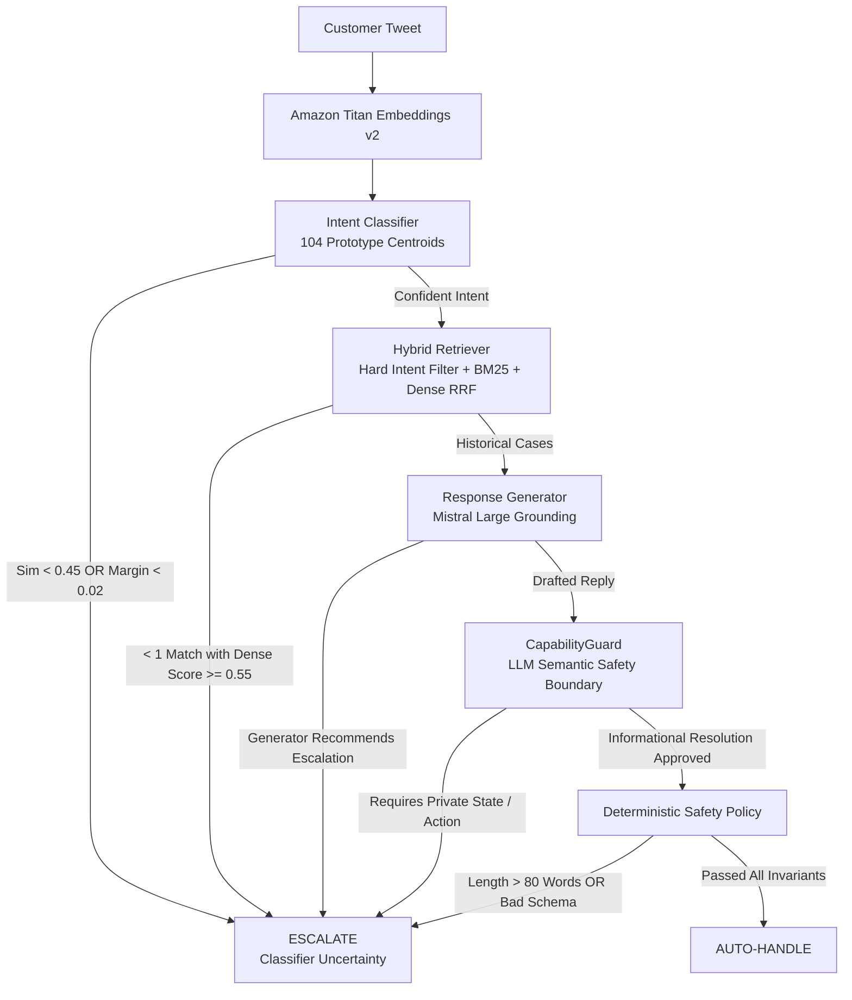

# AmazonHelp AI Support Agent

An autonomous customer support agent built on the Twitter Customer Support (TWCS) dataset, designed to safely triage and resolve support queries for **@AmazonHelp** using semantic intent classification, intent-conditioned hybrid retrieval, grounded response generation, an LLM-based **CapabilityGuard**, and a deterministic safety policy.

---

## Assignment Deliverables Index

This repository satisfies all 5 core deliverables specified in the **SDE Intern Take-Home Assignment**:

| Deliverable | Requirement | Location / Artifact |
| :--- | :--- | :--- |
| **1. Runnable Pipeline Repo** | Reproduce headline results in **<15 minutes** | [`run_quick_reproduction.sh`](run_quick_reproduction.sh), [`scripts/verify_submission_artifacts.py`](scripts/verify_submission_artifacts.py) |
| **2. Golden Evaluation Set** | 150–250 hand-labelled examples with sampling & labeling note | [`data/processed/eval/golden_labels_manual.csv`](data/processed/eval/golden_labels_manual.csv), [`REPORT.md`](REPORT.md) |
| **3. Evaluation Harness** | Automated metrics + LLM judge + Human–Judge concordance | [`scripts/11_run_evaluation.py`](scripts/11_run_evaluation.py), [`scripts/12_llm_judge.py`](scripts/12_llm_judge.py), [`scripts/13_judge_human_agreement.py`](scripts/13_judge_human_agreement.py) |
| **4. Technical Report** | Max 6 pages: framing, 2 baselines, top 5 failure modes, misleading headline section, roadmap | [`REPORT.md`](REPORT.md) |
| **5. Decision Log** | Plain list of 10–15 non-obvious engineering decisions and rationale | [`DECISION_LOG.md`](DECISION_LOG.md) (14 decisions) |

---

## Headline Results (200-Case Evaluation Set)

The automated evaluation harness measures end-to-end triage performance on the full 200-case audited evaluation set. A separate LLM-as-a-judge benchmark evaluates response quality on the 47 cases labeled safe to auto-handle.

### A. Triage Correctness (Decision Safety across 200 Cases: 76.5% Escalate / 23.5% Auto-Handle)

| Evaluation Metric | Measured Value | What It Proves |
| :--- | :---: | :--- |
| **Unsafe Auto-Handle Rate** | **0.0% (0 / 200)** | No case labeled as requiring escalation was auto-handled by the evaluated system. |
| **Auto-Handle Precision** | **100.0% (13 / 13)** | Every case the system auto-handled matched the audited safe-to-automate label. |
| **Escalation Recall** | **100.0% (153 / 153)** | Every case labeled as requiring escalation was escalated. |
| **Auto-Handle Coverage** | **6.5% (13 / 200)** | 13 autonomous resolutions out of 200 cases at the evaluated operating point. |
| **Auto-Handle Recall** | **27.7% (13 / 47)** | 13 of 47 audited safe cases were automated; the remaining 34 were safely escalated. |
| **Intent Classifier Abstention** | **34.5% (69 / 200)** | The classifier abstains when cosine similarity < 0.45 or the top-2 margin < 0.02. |

### B. Response Quality Benchmark (47-Case Conditional Cohort)

Scored on a 1–5 rubric across 6 dimensions, comparing the **proposed pipeline** against a simple BM25 retrieval baseline:

| Quality Dimension (1–5) | Proposed Pipeline | Simple Baseline (BM25 Top-1 Reply) | Verdict |
| :--- | :---: | :---: | :--- |
| **Correctness** | **4.87 / 5.00** | 2.38 / 5.00 | Generated responses accurately address the customer's stated problem. |
| **Resolution Appropriateness** | **4.68 / 5.00** | 2.40 / 5.00 | Responses generally follow demonstrated historical resolution patterns. |
| **Groundedness** | **4.45 / 5.00** | 2.40 / 5.00 | Responses are grounded in retrieved historical AmazonHelp evidence. |
| **Completeness** | **4.83 / 5.00** | 2.38 / 5.00 | Replies address the relevant parts of the customer's request. |
| **Communication Quality** | **4.98 / 5.00** | 3.81 / 5.00 | Responses are natural and appropriate for a Twitter support interaction. |
| **Overall Quality** | **4.72 / 5.00** | 2.38 / 5.00 | Substantial improvement over the simple retrieval baseline (+2.34). |

### The One Intentional Caveat: Conservative Coverage

The agent is designed to be safe first, autonomous second.

- **Deliberate Safety Trade-off:** Coverage is **6.5% (13/200)**. Among the **47 audited cases labeled safe to auto-handle**, the system autonomously handled 13 and escalated 34.
- **Design Principle:** We deliberately optimize for safe automation rather than maximum coverage: false auto-handles are treated as substantially more costly than unnecessary escalations.
- **Abstention Policy:** When intent similarity is borderline (<0.45), sibling margin is narrow (<0.02), or historical evidence is insufficient (<1 strong precedent with `dense_score >= 0.55`), the system abstains and escalates rather than forcing an uncertain decision.
- **Benchmark Independence:** The response-quality benchmark (4.72/5.00) is conditional on audited safe-to-automate cases (`N=47`) and is strictly separate from the 200-case end-to-end triage decision.
- **Data Partitioning:** Training and evaluation were strictly partitioned by `conversation_id` (`seed=42`) with 0% conversation overlap against the 8,000-case training corpus. Evaluation labels were manually audited with AI assistance.

---

## System Architecture

The agent separates probabilistic operations (classification, retrieval, generation, semantic safety verification) from deterministic operations (structural safety checks and final action gating).



### Architectural Walkthrough

1. **Intent Discovery & Classification**
   - **Discovery:** Customer messages in a 1,500-sample discovery cohort were normalized into concise core problems via LLM, clustered with agglomerative clustering (cosine distance + average linkage), and deduplicated into a frozen **104-intent taxonomy**.
   - **Centroid Classifier:** Queries are embedded via Amazon Titan Embeddings v2 and scored against the 104 normalized intent centroids. The classifier outputs `uncertain` if top similarity < 0.45 or the top-2 margin < 0.02.

2. **Intent-Conditioned Hybrid Retrieval**
   - The predicted intent is used as a **hard candidate filter before ranking** to prune operationally unrelated cases.
   - Remaining candidates are ranked with **BM25 lexical search** and **Titan Dense cosine similarity**, fused using **Reciprocal Rank Fusion (RRF)**.
   - **Evidence Gate:** Requires at least **1 strong historical precedent** with `dense_score >= 0.55`.

3. **Grounded Response Generation (Asymmetric Trust)**
   - Retrieved historical cases are injected into Mistral Large (2407 via Bedrock).
   - Historical **customer text is treated as untrusted problem context**; only historical **AmazonHelp responses** are used as evidence for demonstrated resolution patterns.

4. **Semantic Safety via LLM CapabilityGuard**
   - A dedicated Mistral Large call inspects the draft reply against the customer inquiry.
   - It evaluates whether the inquiry is fully resolvable via public informational guidance, or whether it requires private account access, backend state, an unavailable action, or a human support workflow such as a form or DM.

5. **Deterministic Structural Safety Policy**
   - Enforces hard schema invariants, non-empty replies, a word ceiling (>80 words escalates), and CapabilityGuard approval.
   - The final policy is fail-closed: any unmet safety condition results in escalation.

---

## Quickstart & Reproduction (<15 Minutes)

### 1. Environment Setup

```bash
# Clone and enter the repository
git clone <repo-url>
cd hiver-sde-intern

# Create and activate a virtual environment
python3 -m venv .venv
source .venv/bin/activate

# Install dependencies
pip install -r requirements.txt

# Optional: configure AWS Bedrock credentials for live LLM inference
cp .env.example .env
# Edit .env with your AWS credentials and AWS_REGION=us-west-2
```

### 2. Instant Artifact Verification (<1 Second)

Validate the 104-intent taxonomy, SHA-256 hash match, 8,000 training-case coverage, 200 golden evaluation cases, zero train/eval conversation overlap, and the headline metrics summary:

```bash
python scripts/verify_submission_artifacts.py
```

### 3. Headline Reproduction Pipeline

```bash
bash run_quick_reproduction.sh
```

This path reuses the frozen artifacts/checkpoints and runs the retrieval build, classifier compilation, component smoke tests, 200-case evaluation, 47-case LLM-judge benchmark, and human–judge agreement workflow.

**Note:** The quick path supports checkpoint resumption. Live re-evaluation requires AWS Bedrock credentials and reruns the model-dependent evaluation steps.

### 4. Interactive Single-Query Evaluation

Test any custom customer tweet through the complete 5-stage agent pipeline:

```bash
python scripts/09_run_agent.py --query "Where is my delayed package? Tracking has not updated in 3 days."
```

---

## Live Agent Decision Demonstrations (Decide + Stated Reason)

Below are three live runs demonstrating the system's decision-making across distinct scenarios, directly proving compliance with the assignment requirement to classify, ground replies, and decide auto-handle vs. escalate with a stated operational reason:

### Scenario 1: Safe Public Informational Query (Auto-Handled)

- **Customer Tweet:** `@AmazonHelp is it possible to give Amazon Prime membership as a gift in the U.K.?`
- **Classification:** `prime_subscription_query` (Top-1 sim: 0.5171 > 0.45, margin: 0.0219 > 0.02). Both similarity and margin thresholds are satisfied.
- **Historical Retrieval:** Retrieved Case 2166047 (`dense_score = 0.8550`, `bm25 = 16.31`, `rrf = 0.0328`).
- **Response Generation:** Drafts a reply and recommends `auto_handle`.
- **CapabilityGuard:** `auto_handle` — the response can be provided using public information.
- **Final Action:** **`AUTO_HANDLE`**
- **Stated Reason:** Consistent with historical responses for similar queries.
- **Draft Reply:** *"@Customer Hi, sorry but that feature isn't available in the UK at the moment. We haven't made any announcements about this to date. ^JJ"*

### Scenario 2: Inquiry Requiring Private Order State (Safely Escalated via Capability Boundary)

- **Customer Tweet:** `@AmazonHelp can i change my delivery date after ordering?`
- **Classification:** `address_change_request` (Top-1 sim: 0.5292, margin: 0.0503).
- **Historical Retrieval:** Retrieved 3 historical precedent cases.
- **Response Generation:** Drafts a reply with a web link and recommends `auto_handle`.
- **CapabilityGuard:** **`ESCALATE`** — *"The customer's inquiry requires access to their specific order details, which the agent cannot handle autonomously."*
- **Final Action:** **`ESCALATE`**
- **Stated Reason:** *"The customer's inquiry requires access to their specific order details, which the agent cannot handle autonomously."*
- **Significance:** The generator's proposed action is not final authority. CapabilityGuard vetoes the proposed auto-handle (`Generator → AUTO_HANDLE → CapabilityGuard → ESCALATE → Final: ESCALATE`) because modifying an in-flight order requires private customer state and an unavailable support workflow.

### Scenario 3: Phishing / Scam Report (Auto-Handled Guidance)

- **Customer Tweet:** `@AmazonHelp fake mail asking for credit card details. Is this official?`
- **Classification:** `suspicious_activity_report` (Top-1 sim: 0.6371, margin: 0.1255).
- **Historical Retrieval:** Retrieved Cases 2954482, 2474954, 2905013 (`dense = 0.6622`).
- **Response Generation:** Drafts security guidance and recommends `auto_handle`.
- **CapabilityGuard:** `auto_handle` — provides general public guidance without accessing private account data.
- **Final Action:** **`AUTO_HANDLE`**
- **Stated Reason:** Consistent with the pattern of responses for similar cases.
- **Draft Reply:** *"@Customer Thank you for bringing this to our attention! We would never request personal information via Twitter. Please do not provide any account details. If you receive more suspicious emails, you can report them directly via: https://t.co/ScIX65iVYc. Thank you! ^NV"*

---

## Project Structure

```text
hiver-sde-intern/
├── README.md                                # System overview, architecture, reproduction guide
├── REPORT.md                                # Comprehensive technical evaluation report
├── DECISION_LOG.md                          # 14 non-obvious engineering decisions & rationale
├── requirements.txt                         # Pinned Python package dependencies
├── .env.example                             # Template environment configuration
├── run_quick_reproduction.sh                # Headline reproduction script
├── run_full_rebuild.sh                      # Full from-scratch rebuild script
├── artifacts/
│   └── final_run_manifest.json              # Run parameters, seeds, models, taxonomy hash
├── data/
│   └── processed/
│       ├── classifier/                      # 104 prototype centroids & intent metadata
│       ├── eval/                            # Golden set, predictions, judge scores, metrics
│       ├── intent_taxonomy.json             # Frozen 104-intent taxonomy
│       ├── intent_taxonomy_meta.json        # Taxonomy SHA-256 & metadata
│       ├── intent_assignments.parquet       # 8,000 assigned training cases
│       ├── intent_assignment_embeddings.npy # Ordered Titan embedding vectors
│       ├── intent_assignment_ids.json       # IDs matching assignment embeddings
│       └── support_cases_train.parquet      # 8,000 clean AmazonHelp conversations
├── scripts/
│   ├── verify_submission_artifacts.py       # Submission integrity validator
│   ├── 01_explore_dataset.py                # Dataset extraction & brand selection
│   ├── 02_reconstruct_conversations.py      # Conversation tree reconstruction
│   ├── 03_build_cases.py                    # Support case assembly
│   ├── 04_discover_intents.py               # Final intent discovery pipeline
│   ├── 05_diagnose_similarity.py            # Similarity diagnostics
│   ├── 06_build_retriever.py                # Hybrid retriever indexer
│   ├── 07_build_classifier.py               # Prototype centroid builder
│   ├── 08_test_agent_components.py          # Component smoke tester
│   ├── 09_run_agent.py                      # Interactive CLI agent
│   ├── 10_create_eval_set.py                # Conversation-level train/eval split
│   ├── 10b_prepare_human_labels.py          # Golden-set labeling workflow
│   ├── 11_run_evaluation.py                 # End-to-end 200-case evaluation harness
│   ├── 12_llm_judge.py                      # LLM-as-a-judge response benchmark
│   ├── 13_judge_human_agreement.py          # Human–judge concordance metrics
│   └── inspect_cases.py                     # Dataset inspection utility
└── src/
    ├── agent/                               # CapabilityGuard, ResponseGenerator, Deterministic Policy
    ├── classification/                      # Centroid-based IntentClassifier
    └── retrieval/                           # Hard intent filter + BM25 + Dense RRF
```
